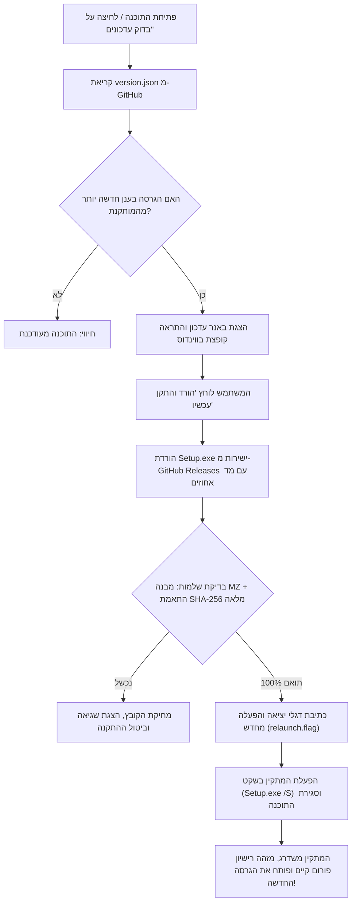

# מדריך מנגנון העדכונים, האבטחה ונוהל שחרור גרסאות

מסמך זה מרכז ומסביר את כל עקרונות מנגנון העדכונים האוטומטיים של תוכנת **"בין הזמנים"**, מדיניות האבטחה החינמית והעצמאית, ואת סדר הפעולות המדויק לשחרור מהדורות חדשות בעתיד.

---

## 1. עקרון יסוד: אבטחה מלאה ללא עלות כספית

תוכנת "בין הזמנים" היא פרויקט עצמאי לתועלת הציבור. 
**אין שום צורך לשלם כספים או לרכוש תעודות אבטחה מסחריות (כגון חתימת Authenticode מסחרית ממיקרוסופט שעולה מאות דולרים בכל שנה).**

מנגנון העדכונים בתוכנה נבנה עם שכבות הגנה קריפטוגרפיות מובנות (ללא עלות) המבטיחות ב-100% שכל עדכון שמותקן הוא מקורי, שלם ובטוח:

### שכבות האבטחה של התוכנה:
1. **ערוץ תקשורת מוצפן (HTTPS):** התוכנה פונה אך ורק ב-HTTPS מאובטח מול שרתי GitHub הרשמיים.
2. **אימות מקור רשמי:** התוכנה מוודאת שכתובת ההורדה שייכת באופן בלעדי למאגר הרשמי:
   `https://github.com/Lev-Good/Between-times/releases/...`
   כל ניסיון להפנות לכתובת חיצונית נדחה מיד בקוד.
3. **בדיקת תקינות קובץ ההרצה (PE MZ Header):** הקובץ שהורד נבדק לוודא שהוא קובץ הפעלה תקין של Windows (פתיח `MZ`), בגודל הגיוני (מעל 1MB ומתחת ל-250MB), כדי למנוע הרצה של קבצים פגומים, הורדות קטועות או דפי שגיאה.
4. **אימות טביעת אצבע דיגיטלית (SHA-256 Hash):**
   * הקובץ [`version.json`](../version.json) במאגר הראשי מכיל את טביעת האצבע המדויקת של קובץ ההתקנה.
   * התוכנה מחשבת בעצמה את ה-SHA-256 של הקובץ שהורד לפני כל פעולה.
   * אם יש אפילו שינוי של תו בודד בקובץ – **התוכנה מוחקת מיד את הקובץ מהדיסק ומבטלת את ההתקנה**.
   * מכיוון שרק לבעל המאגר ב-GitHub יש הרשאה לעדכן את `version.json` ואת ה-Release – לא ניתן לזייף עדכון.

---

## 2. איך עובד מנגנון העדכון האוטומטי בתוך התוכנה



### שימור רישיון פורום העורכים התורניים בעת שדרוג:
במתקין התוכנה הוטמע מנגנון שבודק בעת ההפעלה האם קיים כבר רישיון תקף במחשב:
`%ProgramData%\BenHazmanim\license.json`
אם המשתמש כבר אימת רישיון בעבר – **המתקין מדלג אוטומטית על מסך הזנת הרישיון** ומשלים את השדרוג באופן שקוף ומהיר.

---

## 3. נוהל עבודה (Checklist) לשחרור גרסה חדשה בעתיד

כאשר רוצים להוציא גרסה חדשה (למשל `1.6.1` או `1.7.0`), מבצעים את 7 השלבים הבאים לפי הסדר:

### שלב 1: עדכון מספר הגרסה
בקובץ `package.json`, עדכנו את שדה ה-version:
```json
"version": "1.7.0"
```
בנוסף, עדכנו את **גרסאות ברירת המחדל** המוצגות בממשק — `renderer/index.html`,
שני המקומות עם `id="version"` ו-`id="version2"`. (התוכנה דורסת אותן בזמן ריצה
לפי `package.json`, אבל בלעדן התצוגה המקדימה מציגה מספר גרסה שגוי.)

עדכנו גם את `docs/CHANGELOG.md` (רשימת השינויים למשתמש) ואת מסמך המיגרציה של
הגרסה החדשה (`docs/MIGRATION-<version>.md`), הכולל את מטריצת הבדיקות הידניות
ב-VM. שינויי מדיניות שאינם תואמים לאחור (למשל דרישת סיסמה חדשה) חייבים להופיע
בשני המסמכים.

### שלב 2: הרצת בדיקות תקינות
לפני כל בנייה, הריצו בטרמינל:
```powershell
npm test
```
וודאו שכל **315 הבדיקות** עוברות בהצלחה (Pass). שימו לב שפלט הבדיקות מפוצל
לכמה קבוצות הרצה (בדיקות ה-E2E מרימות Electron אמיתי) — לסכום יש לקבץ את כל
שורות `ℹ tests`, ולא להסתפק בשורה האחרונה.

לבדיקת ה-E2E בלבד (מהירה יותר, ללא כל שאר החבילה):
```powershell
npm run test:e2e
```

### שלב 3: בניית קובץ המתקין
הריצו את פקודת ההידור:
```powershell
npm run dist
```
בסיום, ייווצר הקובץ בתיקיית הפלט:
`dist\Setup.1.6.1.exe`

### שלב 4: חישוב טביעת ה-SHA-256 של המתקין
הריצו פקודה זו ב-PowerShell (החליפו למספר הגרסה שלכם):
```powershell
(Get-FileHash .\dist\Setup.1.6.1.exe -Algorithm SHA256).Hash.ToLower()
```
העתיקו את המחרוזת בת 64 התווים שמתקבלת.

### שלב 5: עדכון קובץ `version.json`
פתחו את הקובץ `version.json` בשורש הפרויקט ועדכנו את הנתונים:
```json
{
  "version": "1.7.0",
  "url": "https://github.com/Lev-Good/Between-times/releases/latest",
  "sha256": "הדביקו_כאן_את_המחרוזת_משלב_4",
  "notes": "גרסה 1.7.0 — פירוט קצר וברור בעברית של מה שהתחדש או תוקן בגרסה זו."
}
```

> ⚠️ **זהו השלב המסוכן בשחרור.** את ה-`sha256` מעדכנים **אך ורק** מהפלט של שלב
> 4, על הקובץ שנבנה באותה בנייה. פרסום `version.json` עם גרסה חדשה וטביעת אצבע
> שאינה של הקובץ שמועלה ל-Release יגרום לכך שכל לקוח מותקן יוריד את המתקין,
> ייכשל באימות ה-SHA-256 ויבטל את העדכון — כלומר אף משתמש לא יתעדכן. אם הבנייה
> חוזרת על עצמה, יש לחשב את הטביעה מחדש ולעדכן לפני הפרסום.
>
> שימו לב: `version.json` הוא הקובץ שמפעיל את העדכון אצל המשתמשים הקיימים,
> ולכן אין לעדכן אותו מוקדם — עד שלא קיים Release עם הקובץ התואם.

### שלב 6: Commit (בלי לפרסם עדיין)
בצעו Commit של קבצי השחרור. יש להוסיף **רק את קבצי השחרור** — אין להשתמש
ב-`git add .`, כי הוא עלול לכלול שינויים אחרים שבאמצע עבודה:
```powershell
git add package.json version.json renderer/index.html docs/CHANGELOG.md docs/MIGRATION-1.7.0.md
# ובנוסף, רק אם השתנו בגרסה הזו:
# git add main.js preload.js scheduler.js locked-browser.js renderer/ build/ test/
git commit -m "שחרור גרסה 1.7.0"
```

> ⚠️ **אל תדחפו את `main` לפני שיצרתם את ה-Release.** `version.json` יושב על
> `main`, וכל לקוח מותקן קורא אותו משם. אם `main` יידחף ראשון, קיים חלון שבו
> הלקוחות כבר רואים "גרסה 1.7.0" בעוד שהערכים ב-`releases/latest` הם של הגרסה
> הקודמת — כל מי שיבדוק עדכון בחלון הזה יוריד קובץ שטביעתו אינה תואמת ויבטל את
> העדכון. לכן סדר השלבים הוא: תג ← Release ← `main`.

### שלב 7: דחיפת התג ויצירת Release ב-GitHub
1. דחפו **את התג בלבד** (הקומיט כבר קיים, והענף `main` עדיין לא מתפרסם):
   ```powershell
git push origin HEAD:refs/tags/v1.7.0
   ```
2. צרו את ה-Release עם הקובץ, כשהוא מסומן כ-Latest:
   ```powershell
gh release create v1.7.0 "dist\Setup.1.7.0.exe" `
  --title "גרסה 1.7.0 — תקציר השינוי" `
  --notes-file "dist\release-notes.md" --latest
   ```
   (או דרך הדפדפן: `https://github.com/Lev-Good/Between-times/releases/new`,
   Tag name `v1.7.0`, גרירת ה-EXE ל-Attach binaries, **Publish release**.)
3. **ודאו שהנכס הועלה שלם** — גודל הנכס ב-Release חייב להיות זהה לגודל הקובץ
   המקומי, וטביעת ה-`digest` שגיטהאב מחשבת חייבת להיות זהה לזו שב-`version.json`:
   ```powershell
gh api repos/Lev-Good/Between-times/releases/tags/v1.7.0 `
  -q '.assets[] | .name + " " + (.size|tostring) + " " + (.digest // "")'
   ```
4. **רק עכשיו** דחפו את הענף — זה הרגע שבו העדכון נפתח למשתמשים:
   ```powershell
git push origin main
   ```
5. וידוא סופי: `releases/latest` מחזיר את התג החדש, ו-`version.json` שיושב על
   `main` מכיל את אותה גרסה ואותה טביעת אצבע של הנכס שהועלה.

**זה הכל!** 
מיד עם שלב 7.4, כל משתמש שיש לו את התוכנה במחשב יקבל התראה על הגרסה החדשה, ויוכל לעדכן אותה בלחיצת כפתור אחת.
