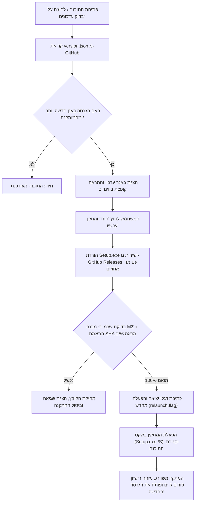

# מדריך מנגנון העדכונים, האבטחה ונוהל שחרור גרסאות

מסמך זה מרכז ומסביר את כל עקרונות מנגנון העדכונים האוטומטיים של תוכנת **"בין הזמנים"**, מדיניות האבטחה החינמית והעצמאית, ואת סדר הפעולות המדויק לשחרור מהדורות חדשות בעתיד.

---

## 1. עקרון יסוד: אבטחה מלאה ללא עלות כספית

תוכנת "בין הזמנים" היא פרויקט עצמאי לתועלת הציבור. 
**אין שום צורך לשלם כספים או לרכוש תעודות אבטחה מסחריות (כגון חתימת Authenticode מסחרית ממיקרוסופט שעולה מאות דולרים בכל שנה).**

מנגנון העדכונים בתוכנה נבנה עם שכבות הגנה קריפטוגרפיות מובנות (ללא עלות) המבטיחות ב-100% שכל עדכון שמותקן הוא מקורי, שלם ובטוח:

### שכבות האבטחה של התוכנה:
1. **ערוץ תקשורת מוצפן (HTTPS):** התוכנה פונה אך ורק ב-HTTPS מאובטח מול שרתי GitHub הרשמיים.
2. **אימות מקור רשמי:** התוכנה מוודאת שכתובת ההורדה שייכת באופן בלעדי למאגר הרשמי:
   `https://github.com/Lev-Good/Between-times/releases/...`
   כל ניסיון להפנות לכתובת חיצונית נדחה מיד בקוד.
3. **בדיקת תקינות קובץ ההרצה (PE MZ Header):** הקובץ שהורד נבדק לוודא שהוא קובץ הפעלה תקין של Windows (פתיח `MZ`), בגודל הגיוני (מעל 1MB ומתחת ל-250MB), כדי למנוע הרצה של קבצים פגומים, הורדות קטועות או דפי שגיאה.
4. **אימות טביעת אצבע דיגיטלית (SHA-256 Hash):**
   * הקובץ [`version.json`](../version.json) במאגר הראשי מכיל את טביעת האצבע המדויקת של קובץ ההתקנה.
   * התוכנה מחשבת בעצמה את ה-SHA-256 של הקובץ שהורד לפני כל פעולה.
   * אם יש אפילו שינוי של תו בודד בקובץ – **התוכנה מוחקת מיד את הקובץ מהדיסק ומבטלת את ההתקנה**.
   * מכיוון שרק לבעל המאגר ב-GitHub יש הרשאה לעדכן את `version.json` ואת ה-Release – לא ניתן לזייף עדכון.

---

## 2. איך עובד מנגנון העדכון האוטומטי בתוך התוכנה



### שימור רישיון פורום העורכים התורניים בעת שדרוג:
במתקין התוכנה הוטמע מנגנון שבודק בעת ההפעלה האם קיים כבר רישיון תקף במחשב:
`%ProgramData%\BenHazmanim\license.json`
אם המשתמש כבר אימת רישיון בעבר – **המתקין מדלג אוטומטית על מסך הזנת הרישיון** ומשלים את השדרוג באופן שקוף ומהיר.

---

## 3. נוהל עבודה (Checklist) לשחרור גרסה חדשה בעתיד

כאשר רוצים להוציא גרסה חדשה (למשל `1.6.1` או `1.7.0`), מבצעים את 7 השלבים הבאים לפי הסדר:

### שלב 1: עדכון מספר הגרסה
בקובץ `package.json`, עדכנו את שדה ה-version:
```json
"version": "1.6.1"
```

### שלב 2: הרצת בדיקות תקינות
לפני כל בנייה, הריצו בטרמינל:
```powershell
npm test
```
וודאו שכל 118 הבדיקות עוברות בהצלחה (Pass).

### שלב 3: בניית קובץ המתקין
הריצו את פקודת ההידור:
```powershell
npm run dist
```
בסיום, ייווצר הקובץ בתיקיית הפלט:
`dist\Setup.1.6.1.exe`

### שלב 4: חישוב טביעת ה-SHA-256 של המתקין
הריצו פקודה זו ב-PowerShell (החליפו למספר הגרסה שלכם):
```powershell
(Get-FileHash .\dist\Setup.1.6.1.exe -Algorithm SHA256).Hash.ToLower()
```
העתיקו את המחרוזת בת 64 התווים שמתקבלת.

### שלב 5: עדכון קובץ `version.json`
פתחו את הקובץ `version.json` בשורש הפרויקט ועדכנו את הנתונים:
```json
{
  "version": "1.6.1",
  "url": "https://github.com/Lev-Good/Between-times/releases/latest",
  "sha256": "הדביקו_כאן_את_המחרוזת_משלב_4",
  "notes": "גרסה 1.6.1 — פירוט קצר וברור בעברית של מה שהתחדש או תוקן בגרסה זו."
}
```

### שלב 6: שמירה ודחיפה ל-GitHub
בצעו Commit ו-Push ל-Git:
```powershell
git add .
git commit -m "שחרור גרסה 1.6.1"
git push origin main
```

### שלב 7: יצירת Release ב-GitHub והעלאת הקובץ
1. גשו לדף ה-Releases במאגר הגיטהאב:
   `https://github.com/Lev-Good/Between-times/releases/new`
2. ב-Tag name רשמו: `v1.6.1`
3. ב-Release title רשמו: `בין הזמנים 1.6.1`
4. בתיאור רשמו את השינויים.
5. גררו את הקובץ `dist\Setup.1.6.1.exe` לאזור הצירופים (Attach binaries).
6. לחצו **Publish release**.

**זה הכל!** 
מיד עם סיום שלב זה, כל משתמש שיש לו את התוכנה במחשב יקבל התראה על הגרסה החדשה, ויוכל לעדכן אותה בלחיצת כפתור אחת.
